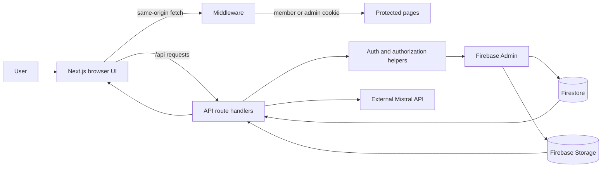
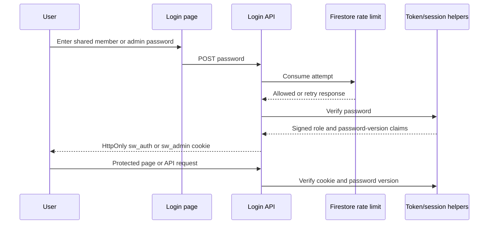
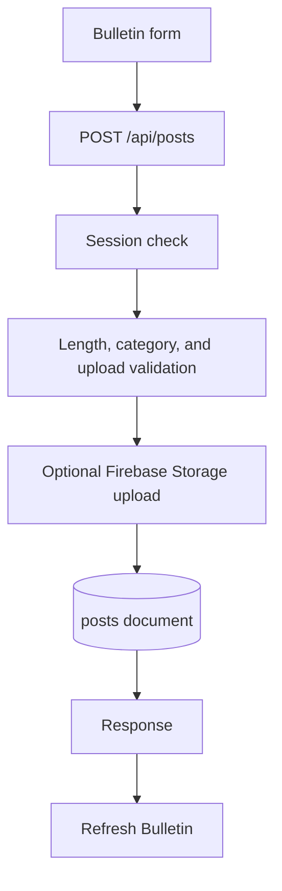
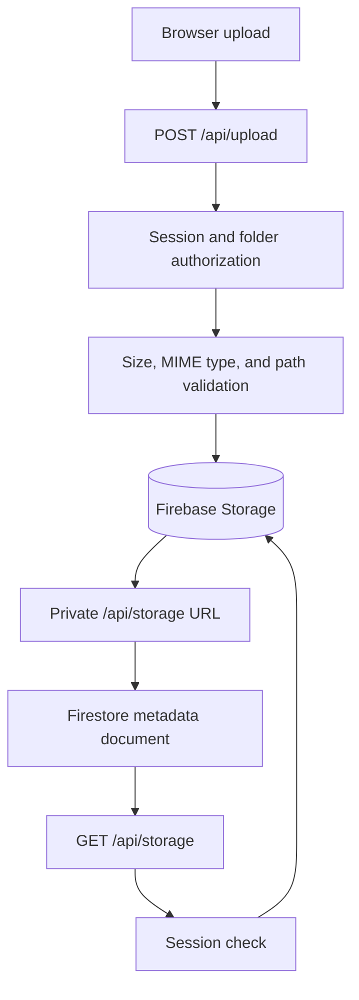
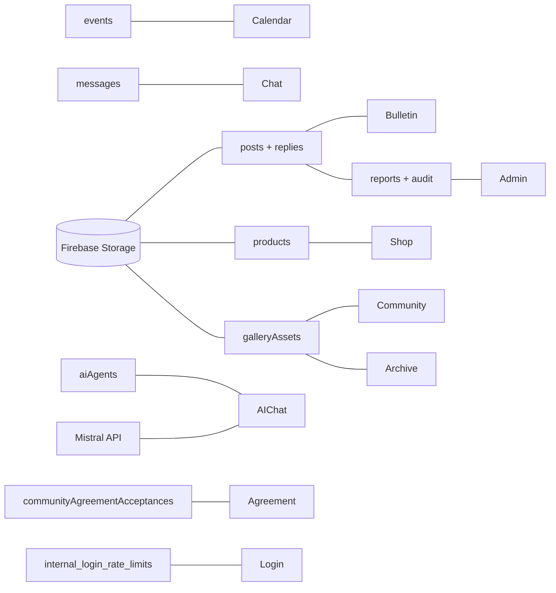

# Architecture Diagrams

## High-level architecture

```mermaid
flowchart LR
  U[User] --> B[Next.js browser UI]
  B -->|same-origin fetch| M[Middleware]
  M -->|member or admin cookie| P[Protected pages]
  B -->|/api requests| A[API route handlers]
  A --> Z[Auth and authorization helpers]
  Z --> F[Firebase Admin]
  F --> D[(Firestore)]
  F --> S[(Firebase Storage)]
  A --> X[External Mistral API]
  D --> A
  S --> A
  A --> B
```

## Authentication flow

```mermaid
sequenceDiagram
  participant User
  participant Page as Login page
  participant API as Login API
  participant RL as Firestore rate limit
  participant Auth as Token/session helpers

  User->>Page: Enter shared member or admin password
  Page->>API: POST password
  API->>RL: Consume attempt
  RL-->>API: Allowed or retry response
  API->>Auth: Verify password
  Auth-->>API: Signed role and password-version claims
  API-->>User: HttpOnly sw_auth or sw_admin cookie
  User->>API: Protected page or API request
  API->>Auth: Verify cookie and password version
```

## Bulletin flow

```mermaid
flowchart TD
  F[Bulletin form] --> P[POST /api/posts]
  P --> C[Session check]
  C --> V[Length, category, and upload validation]
  V --> U[Optional Firebase Storage upload]
  U --> D[(posts document)]
  D --> R[Response]
  R --> F2[Refresh Bulletin]
```

## Media flow

```mermaid
flowchart TD
  B[Browser upload] --> API[POST /api/upload]
  API --> AUTH[Session and folder authorization]
  AUTH --> VAL[Size, MIME type, and path validation]
  VAL --> STORE[(Firebase Storage)]
  STORE --> URL[Private /api/storage URL]
  URL --> META[Firestore metadata document]
  META --> READ[GET /api/storage]
  READ --> AUTH2[Session check]
  AUTH2 --> STORE
```

## Database dependency map

```mermaid
flowchart LR
  Posts[posts + replies] --- Bulletin
  Posts --- Reports
  Events[events] --- Calendar
  Messages[messages] --- Chat
  Gallery[galleryAssets] --- Community
  Gallery --- Archive
  Products[products] --- Shop
  Agents[aiAgents] --- AIChat
  Reports[reports + audit] --- Admin
  Accept[communityAgreementAcceptances] --- Agreement
  Limits[internal_login_rate_limits] --- Login
  Storage[(Firebase Storage)] --- Posts
  Storage --- Products
  Storage --- Gallery
  Mistral[Mistral API] --- AIChat
```
